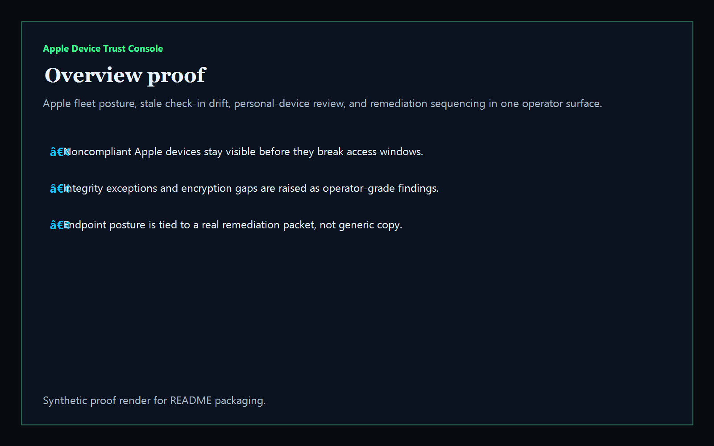
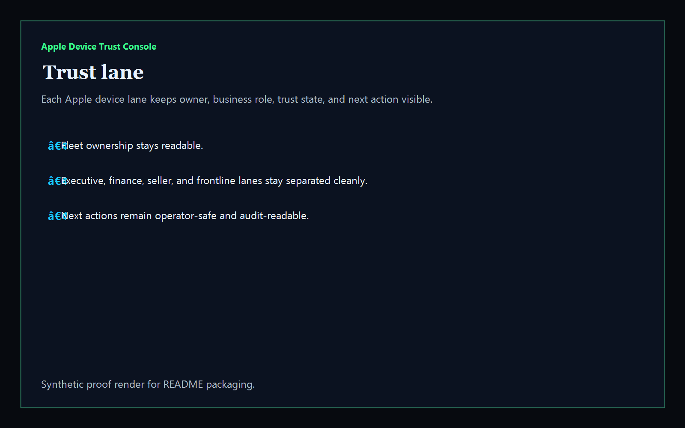
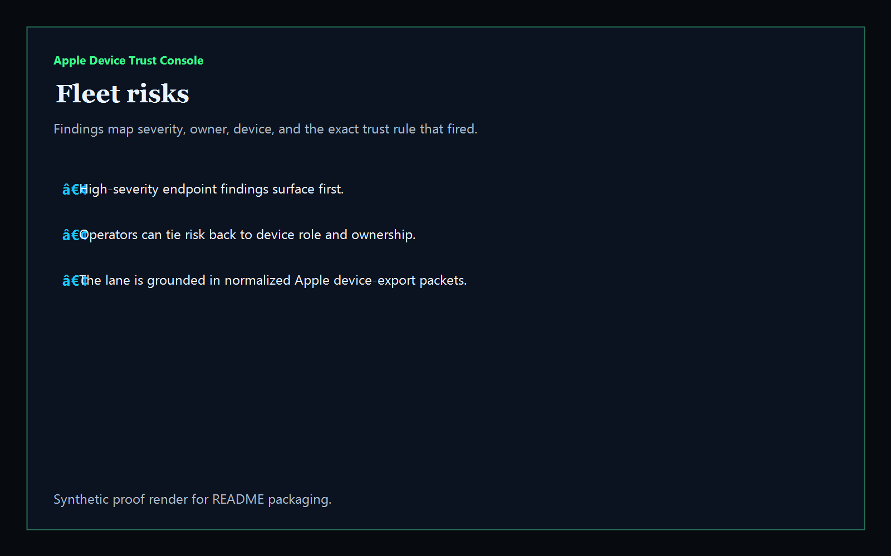
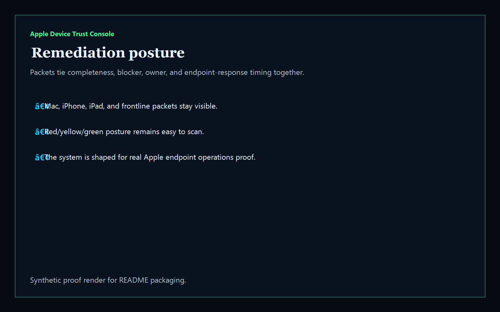

# Apple Device Trust Console

[](https://github.com/mizcausevic-dev/apple-device-trust-console/actions/workflows/ci.yml)
[](./LICENSE)
[](https://github.com/mizcausevic-dev/apple-device-trust-console/actions/workflows/pages.yml)

Operator control plane for Apple device trust, stale check-in risk, encryption drift, personal-device review, and remediation readiness across macOS, iOS, and iPadOS fleets.

## Why this exists

- Endpoint teams need more than a raw MDM export when audits, rollout windows, and user-impacting trust failures collide.
- Apple fleet operators need one surface that shows device risk, stale check-ins, encryption posture, OS drift, and remediation sequencing.
- Recruiters and buyers looking for `Apple device management / macOS / iOS / endpoint security` proof should see a real operator dashboard, not a generic cloud keyword project.
- Device trust becomes more valuable when it is packaged as an operator system for security, platform, and IT operations teams.

## Why this matters (KG Embedded tie-back)

This repo demonstrates the Apple endpoint-trust control-plane primitive for enterprise device operations: fleet posture, stale-device drift, encryption gaps, personal-device review, and remediation packets in one operator surface. Kinetic Gain Embedded extends this pattern into productized in-app dashboards where compliance, security, and device signals need to stay visible without exposing raw admin backends or tenant data. See [kineticgain.com/embedded](https://kineticgain.com/embedded).

## What it shows

- trust-lane visibility for active Apple device cohorts and ownership posture
- fleet-risk detection for noncompliant, integrity-exception, unencrypted, stale, and orphaned devices
- remediation packets for executive Macs, finance laptops, seller iPhones, and frontline iPads
- offline-safe analysis of captured MDM device exports normalized to one shape
- recruiter-facing Apple endpoint operations proof that composes with Entra and Defender governance

## Product depth

Apple Device Trust Console is a board-readable endpoint governance surface for Apple fleets. It gives IT, security, compliance, and platform leaders a single view of stale check-ins, encryption drift, personal-device exposure, OS posture, and remediation sequencing before access windows or rollout plans break.

- **Buyer value:** reduces audit scramble and executive-device surprise by showing which Apple cohorts are safe, which are drifting, and who owns the next fix.
- **Technical proof:** normalizes synthetic MDM-style device exports into trust lanes, risk findings, remediation posture, verification packets, CLI output, and prerendered site routes.
- **GTM story:** positions Apple endpoint posture as a concrete platform/security control plane that complements Entra, Defender, Okta, Jamf-style administration, and broader identity governance.

## What these repos have in common

Every Kinetic Gain operator surface follows the same pattern: convert fragmented admin exports into leadership-readable decisions without exposing live tenant credentials.

- **Risk signal:** stale device check-ins, encryption gaps, personal-device scope, noncompliance, and orphaned ownership are modeled explicitly.
- **Owner context:** every lane ties the finding to an accountable team or operating role.
- **Evidence packet:** summary APIs, sample JSON, screenshots, docs, and CLI output make the proof reusable for audits, demos, and diligence.
- **Next action:** each route names the corrective move so the page is operational, not just descriptive.

## Operating workflow

1. Load a normalized Apple device export or use the included synthetic fixture.
2. Score trust posture across stale check-ins, compliance state, encryption, OS drift, personal-device scope, and ownership.
3. Route the highest-risk devices into remediation packets with owner, rationale, and next action.
4. Publish the static proof surface for review by IT, security, compliance, and buyer-facing teams.

## Routes

- `/`
- `/trust-lane`
- `/fleet-risks`
- `/remediation-posture`
- `/verification`
- `/docs`

## API

- `/api/dashboard/summary`
- `/api/trust-lane`
- `/api/fleet-risks`
- `/api/remediation-posture`
- `/api/verification`
- `/api/sample`

## Screenshots






## CLI

```powershell
npx apple-device-trust <export.json> `
    --format json|markdown|summary `
    --now 2026-05-27T08:00:00Z `
    --stale-after-days 14 `
    --fail-on-high `
    --out report.md
```

Input is any of:
- a single normalized device object
- an array of devices
- a device collection envelope: `{ "value": [ ... ] }`

## Local Development

```powershell
cd apple-device-trust-console
npm install
npm run dev
```

Open:
- [http://127.0.0.1:5512/](http://127.0.0.1:5512/)
- [http://127.0.0.1:5512/trust-lane](http://127.0.0.1:5512/trust-lane)
- [http://127.0.0.1:5512/fleet-risks](http://127.0.0.1:5512/fleet-risks)
- [http://127.0.0.1:5512/remediation-posture](http://127.0.0.1:5512/remediation-posture)
- [http://127.0.0.1:5512/verification](http://127.0.0.1:5512/verification)

## Validation

- `npm run lint`
- `npm run typecheck`
- `npm run coverage`
- `npm run build`
- `npm run demo`
- `npm run smoke`
- `npm run prerender`
- `npm run render:assets`

## Production status

| Aspect | Status |
|--------|--------|
| CI | Node 20 + 22 matrix — lint · typecheck · coverage · build · demo · smoke · `npm audit` |
| License | [AGPL-3.0-or-later](./LICENSE) |
| Deploy | Static prerender -> **https://apple.kineticgain.com/** |
| Data posture | Synthetic sample data only; no live tenant credentials or export tokens |

## Docs

- [Architecture](./docs/architecture.md)
- [Origin](./docs/ORIGIN.md)
- [Kinetic Gain Embedded tie-back](./docs/KINETIC_GAIN_EMBEDDED.md)
- [Changelog](./CHANGELOG.md)

## Part of the Kinetic Gain Suite

Operator surface in the [Kinetic Gain Suite](https://suite.kineticgain.com/) — a portfolio of buyer-readable control planes spanning security posture, compliance evidence, data-platform governance, FinOps, and operator workflows. See the suite index for related surfaces. Apex: [kineticgain.com](https://kineticgain.com/).
